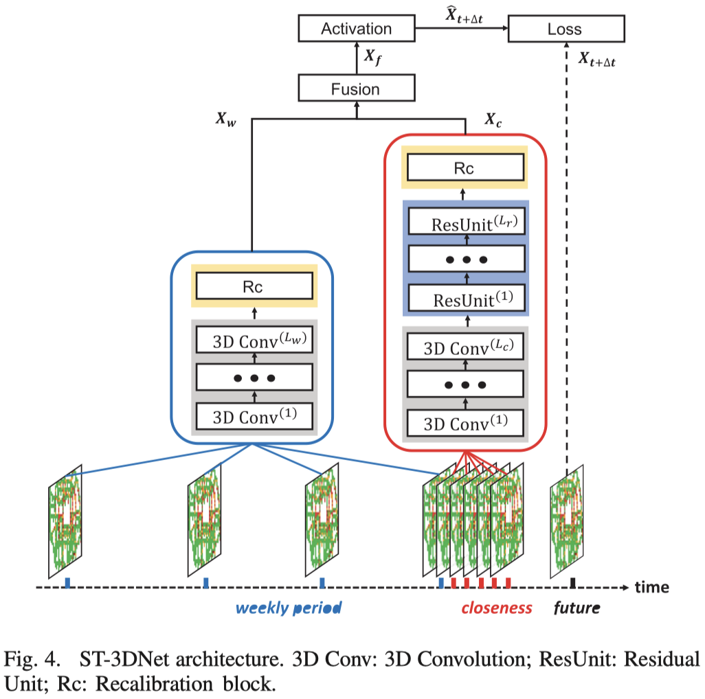

# ST-3DNet

Deep Spatial–Temporal 3D Convolutional Neural Networks for Traffic Data Forecasting



# Reference

```latex
@ARTICLE{8684259,
  author={Guo, Shengnan and Lin, Youfang and Li, Shijie and Chen, Zhaoming and Wan, Huaiyu},
  journal={IEEE Transactions on Intelligent Transportation Systems}, 
  title={Deep Spatial–Temporal 3D Convolutional Neural Networks for Traffic Data Forecasting}, 
  year={2019},
  volume={20},
  number={10},
  pages={3913-3926},
  doi={10.1109/TITS.2019.2906365}}
```

# Datasets

Step 1: Download the datasets provided by the paper 'Deep Spatio-Temporal Residual Networks for Citywide Crowd Flows Prediction' (https://ojs.aaai.org/index.php/AAAI/article/view/10735)  

Step 2: process dataset

```shell
python prepareDataNY.py
python prepareDataBJ.py
```

# Train and Test

```shell
python trainNY.py
python trainBJ.py
```

